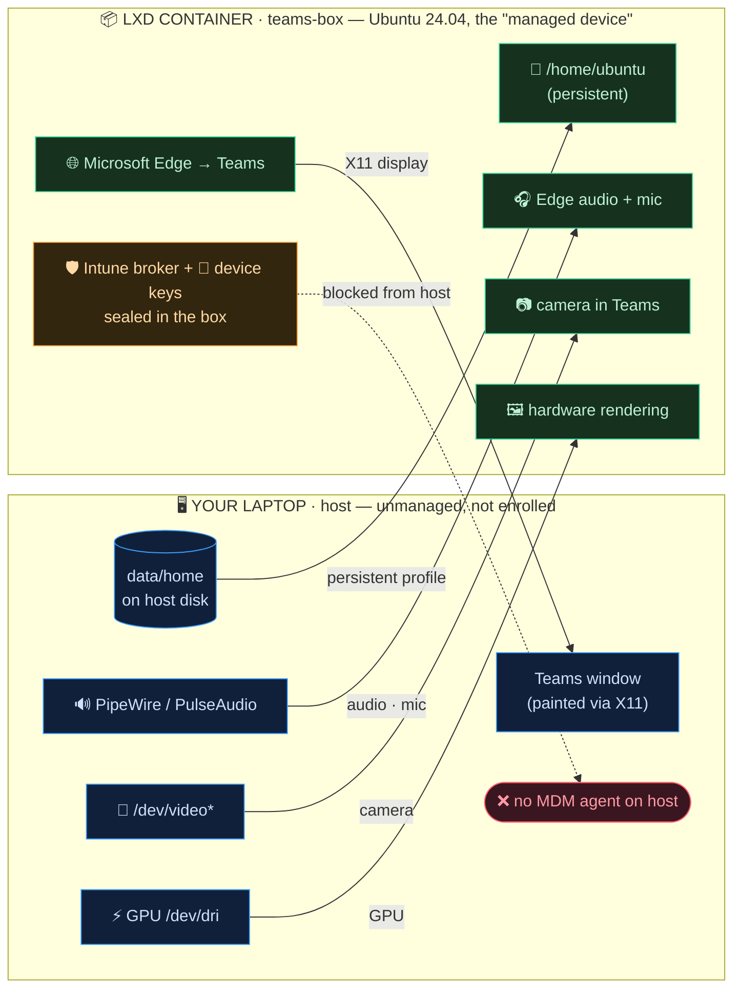

# teams-lxd — Company Teams, off your real laptop

Run Microsoft Teams (via Microsoft Edge) inside a disposable **LXD** container that enrols in
**Intune** on your behalf — so Microsoft's Conditional Access is satisfied, while your actual
machine stays **unmanaged and unenrolled**: no MDM agent ever runs on it.

Edge runs inside the container, but its window paints on your normal desktop through the shared
X11 socket — it looks and feels like a local app, while the compliance agent and the device-bound
keys are sealed inside the box.

> [!NOTE]
> A richer, animated version of this document lives in [`README.html`](README.html) — open it
> locally in a browser for the full diagram with flow animations and copy-to-clipboard commands.

---

## What it is

Microsoft requires that the device touching Teams be enrolled in Intune and pass a
Conditional-Access compliance check. Enrolling your laptop hands your employer an MDM agent with
deep reach into your personal machine. `teams-lxd` moves that burden into a throwaway box: a
Ubuntu 24.04 LXD system container is the thing that gets enrolled.

---

## How to use it

Six subcommands. You run `setup` and `enroll` once; after that it's just `run`.

```text
setup  →  enroll  →  run  ↺  run … run …
```

```bash
./teams-lxd.sh setup     # one-time: create the container, map your UID, attach devices, install Edge + Intune broker
./teams-lxd.sh enroll    # interactive: open the Company Portal, sign in with your work account, finish enrolment
./teams-lxd.sh run       # launch Teams in Edge on your desktop (audio, mic, camera and GPU wired through)
./teams-lxd.sh shell     # drop into a root shell in the container for poking around / debugging
./teams-lxd.sh status    # show container state and whether the identity broker service is alive
./teams-lxd.sh destroy   # remove the container; your login persists in data/ (delete data/ to erase it entirely)
```

Configuration via env vars:

```bash
export TEAMS_CT=teams-box            # container name (default: teams-box)
export TEAMS_KEYRING_PASS=…          # gnome-keyring unlock passphrase — SET THIS (see Security caveats)
export TEAMS_DATA=./data             # persistent data directory (default: ./data)
```

---

## How it works

The container is sealed except for a handful of deliberately punched holes. Edge, audio, video and
the GPU live on the host side of those holes; the Intune agent and its keys never leave the box.
The only things crossing the isolation boundary are a display socket, audio/camera/GPU device nodes
and an optional persistent home — never the management plane.



---

## Why Intune never touches your laptop

Conditional Access asks one question: *"is the device on a compliant, enrolled machine?"*
teams-lxd answers **yes** — about the container. Everything the management plane installs,
fingerprints and trusts is created inside `teams-box`, on the far side of the isolation boundary.
No MDM agent ever runs on your host; the only place the enrolment exists on your disk is the
container's home directory, which you can wipe whenever you like.

| ✅ Stays inside the container | ❌ Never reaches your host |
| --- | --- |
| The Intune / identity-broker agent & daemon | No MDM agent installed or running on your laptop |
| Device-bound compliance keys (in gnome-keyring) | No compliance scan of your host disk or processes |
| The enrolled "managed device" record Microsoft sees | No fingerprint of your *real hardware* registered with the tenant |
| Edge's profile, cookies and work session | Your files, browser and other accounts stay private |
| Any policy or remote-wipe action targets the box | Enrolment lives only in `data/` — delete it to erase everything |

Because your UID is mapped 1:1 into the container, the shared sockets line up by ownership rather
than by loosening permissions on the host.

---

## What's wired through — and the trick that made each work

| Hole | Mechanism | The gotcha it avoids |
| --- | --- | --- |
| **display** | bind-mount `/tmp/.X11-unix` + `xhost +local:` | UID mapped 1:1 so the X cookie & socket ownership line up. |
| **audio + mic** | bind-mount the Pulse/PipeWire sockets to `/tmp` | A proxy connects as root and PipeWire refuses it; a bind-mount keeps your credentials. Mounted under `/tmp`, not `/run/user`, so logind's tmpfs can't shadow it. |
| **camera** | `unix-char` device with `gid=44 mode=0660` | Default node is `root:root` → "device not found". Group `video` lets `ubuntu` open it. |
| **GPU** | `gpu` device + `ubuntu` in `render,video` | Without the groups `/dev/dri` is denied and Edge crawls on software rendering. |
| **persistence** | `data/home` bind-mounted over `/home/ubuntu` | Rebuild the box anytime without re-enrolling or logging back in. |

---

## Security caveats

> [!WARNING]
> This is a convenience tool, not a hardened security product. Be aware of the following before
> trusting it with work credentials:
>
> - **The keyring passphrase defaults to a weak, public value (`teams-sandbox`).** It unlocks the
>   gnome-keyring that holds your Intune **device-bound credentials**. **Always set
>   `TEAMS_KEYRING_PASS` to a strong secret** before `setup`/`enroll`.
> - **Your enrolment is persisted unencrypted in `data/`.** The keyring and Edge profile live on
>   your host disk in cleartext. Anyone who reads `data/` (backups, file sync, another local user,
>   a stolen disk) can unlock and reuse your enrolled identity. Protect that directory — or run
>   `destroy` *and* delete `data/` when you're done. It is `.gitignore`d so it won't be committed.
> - **The passphrase is written in cleartext** into a helper script (`/usr/local/bin/session-init`)
>   inside the container; any process in the container can read it.
> - **`$DISPLAY` is interpolated into a shell command.** Only run this from a session where you
>   trust the value of `$DISPLAY` (i.e. your own desktop).

## Prerequisites

- LXD installed (`sudo snap install lxd && sudo lxd init --minimal`)
- Current user in the `lxd` group
- An X11 or Xwayland session on the host (`$DISPLAY` must be set)
- Tested on Ubuntu 24.04 (noble) containers (26.04 also a supported Intune target)

---

*Built by **fedenunez** · `teams-lxd.sh`*
